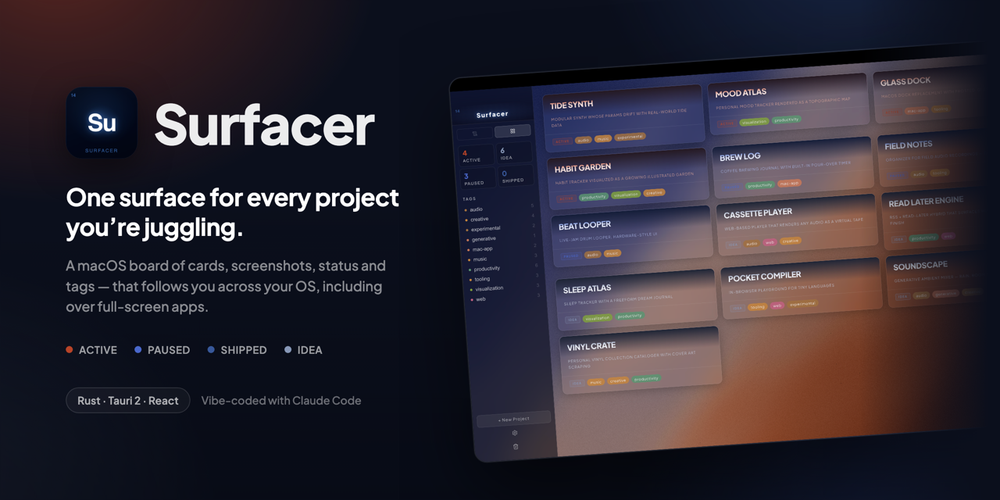
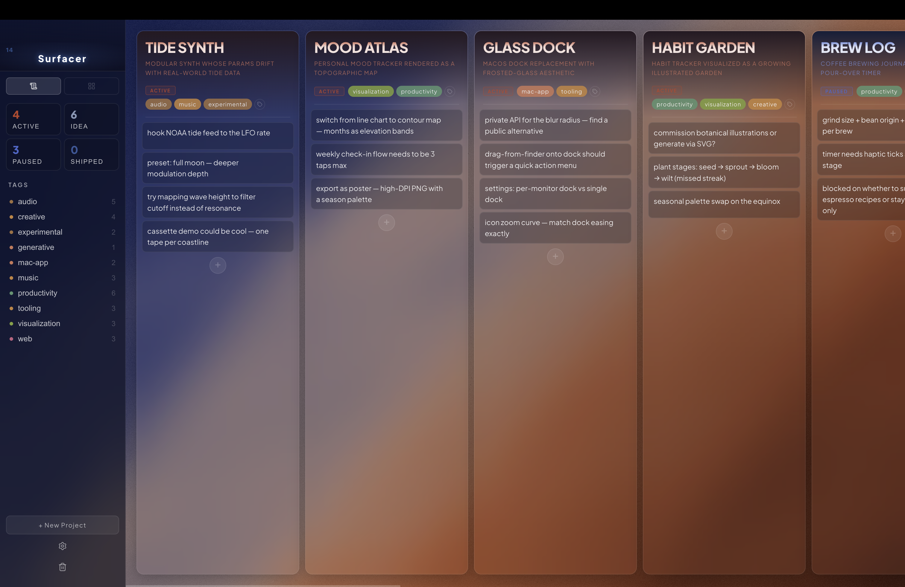
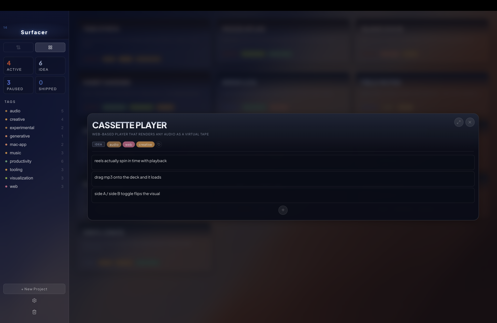
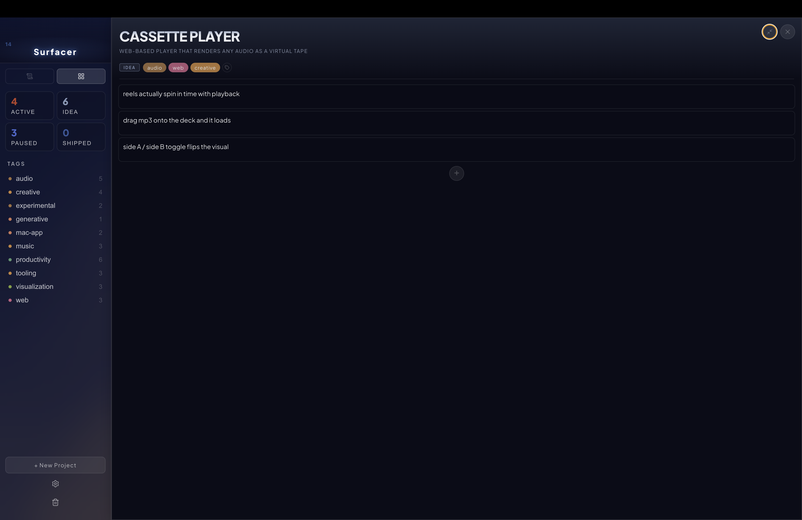
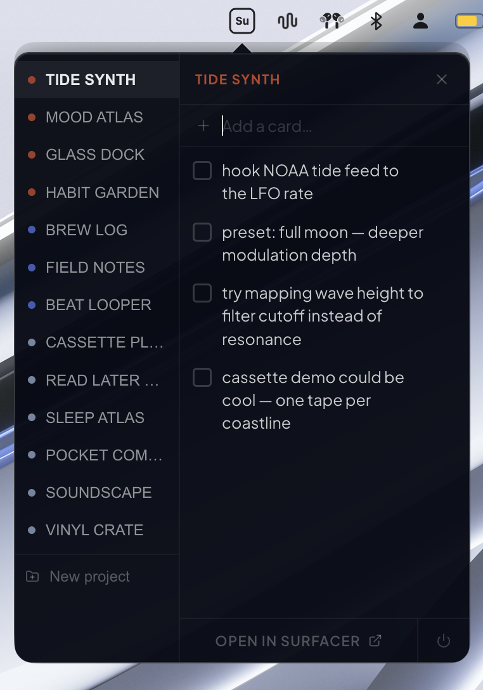
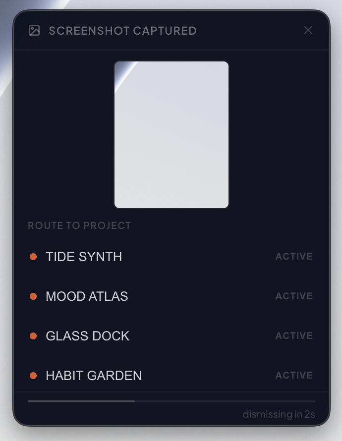

<p align="center">
  
</p>

<h1 align="center">Surfacer</h1>

<p align="center">
  <strong>Personal project tracker for macOS. One surface for every project you're juggling — cards, screenshots, status, tags — that follows you across your OS.</strong>
</p>

<p align="center">
  <em>A vibe-coded macOS app, built end-to-end with (ample) help from Claude Code</em>
</p>

<p align="center">
  
  
  
  
  
  
  
  
</p>

---

## What it is

When I got into vibe coding, ideas about new things to try out or tweak would come to me from left and right, but I'd scramble to record them fresh. I had running lists of project notes and to-do's in Apple Notes mostly, but that was cumbersome. Eventually I crammed all of them into a single note wedged between others: my grocery list, a shared list of songs a friend and I were preparing for a gig, my workout note... Surfacer is what I made to pull the whole spread onto one surface that follows me across my OS.

- **Bulletin board, two views** — every idea I'm chasing lives as a card on one board, color-tinted by status (active / paused / shipped / idea), filterable by tag. A bulletin view for the whole spread at a glance, and a scroll view for the days I'm juggling several at once and want every project's cards open side-by-side.

  <table>
    <tr>
      <td width="50%"></td>
      <td width="50%"></td>
    </tr>
  </table>

  *Two ways to see the board — bulletin view (left) for the whole spread; scroll view (right) for juggling several at once.*

- **Inside a project** — click any project to open it in place as a glass-tinted modal with columns of freeform cards: things you're doing, thinking about, things to come back to. Tags travel with cards. Drag works everywhere. When I need room, the modal expands full-frame.

  <table>
    <tr>
      <td width="50%"></td>
      <td width="50%"></td>
    </tr>
  </table>

  *Project modal — opened in place over the board, then expanded full-frame for room.*

- **Menu-bar popover** — a small **Su** icon in the menu bar opens a frameless popover from anywhere on macOS, including over full-screen apps. Quick-add a card, jump back into a project in the full app, or spin up a new project — all without leaving what you're doing. Surfacer is integrated into the OS, not living in a tab.

  <table>
    <tr>
      <td width="60%"></td>
      <td width="40%"></td>
    </tr>
  </table>

  *Menu-bar popover — Surfacer from anywhere, including over full-screen apps.*

- **Screenshot routing** — any screenshot I take triggers a frameless overlay to route it into a project as a card. The idea came from Austin Kleon's *Steal Like An Artist*: a *swipe file* — a working collection of scraps, clippings, and fragments you return to when developing an idea.

  <table>
    <tr>
      <td width="60%"></td>
      <td width="40%"></td>
    </tr>
  </table>

  *Screenshot routing — every screenshot becomes a card you can route to a project.*

- **Status as identity** — four states (active / paused / shipped / idea) drive accent colors across the entire UI, so the board itself reflects the temperature of what I'm working on. No per-project color theming; status is the color.

- **Local-first** — SQLite on disk in `~/Library/Application Support/com.surfacer.app/`. No accounts, no telemetry, no cloud sync, and no background server of any kind — the UI talks to a small native core over Tauri's in-process IPC.

### What's next

Surfacer V1 is the daily driver I built for myself. A few things on my mind for V2:

- **Mobile companion** — capture cards from your phone, sync to the desktop board. Right now ideas only land in Surfacer if I'm at my Mac.
- **OS-level screenshot extension** — replace the file-watcher with a proper macOS screen-capture extension, so the route-to-project prompt feels native instead of bolted on.
- **Multi-user boards** — Surfacer is single-user today, but I'm excited to explore shared boards for collaborative project tracking down the road.

## Install

Download the latest **[Surfacer.dmg](https://github.com/andrewmfoster/Surfacer/releases/latest/download/Surfacer.dmg)** from Releases, open it, and drag `Surfacer.app` into `/Applications/`. Or [build from source](#build-from-source).

The release is unsigned, so macOS will refuse to open it on first launch with "Apple cannot check it for malicious software." To open it anyway:

1. Right-click `Surfacer.app` in Finder → **Open** → confirm in the dialog.
2. Or open **System Settings → Privacy & Security**, find the message about Surfacer being blocked, and click **Open Anyway**.

macOS remembers after the first launch, so this only happens once.

## Stack

- **UI:** Vite + React 19, TipTap (rich text), `@dnd-kit` (drag and drop), framer-motion, lucide-react
- **Core:** Rust + Tauri 2, rusqlite (bundled SQLite, no system dependency). No separate server process — the renderer calls `#[tauri::command]` functions over capability-gated IPC.
- **Packaging:** Tauri (`npm run tauri build`, Apple Silicon / arm64)

## Build from source

```bash
# Requires: macOS (Apple Silicon), Node 20+, a Rust toolchain (https://rustup.rs)
git clone https://github.com/andrewmfoster/Surfacer.git
cd Surfacer
npm install
npm run tauri build   # → src-tauri/target/release/bundle/macos/Surfacer.app (+ a .dmg)
```

The first Rust build is slow (a few minutes — it compiles a bundled SQLite from source); incremental rebuilds are seconds. To run against a hot-reloading dev build instead, use `npm run tauri dev`.

## Security & privacy

Surfacer runs entirely on-device. There is no server and no network listener of any kind. All data lives unencrypted on disk in `~/Library/Application Support/com.surfacer.app/`. No accounts, no telemetry, no cloud sync.

I'm a UX researcher and hobbyist builder. Feedback and PRs welcome — if you spot something I missed, please open an issue.

## License

MIT — see [LICENSE](LICENSE).
</content>
</invoke>
